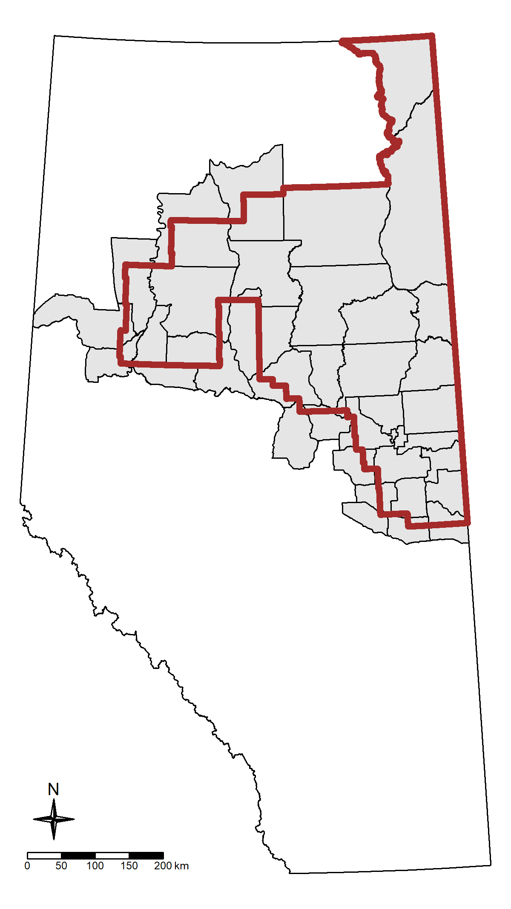
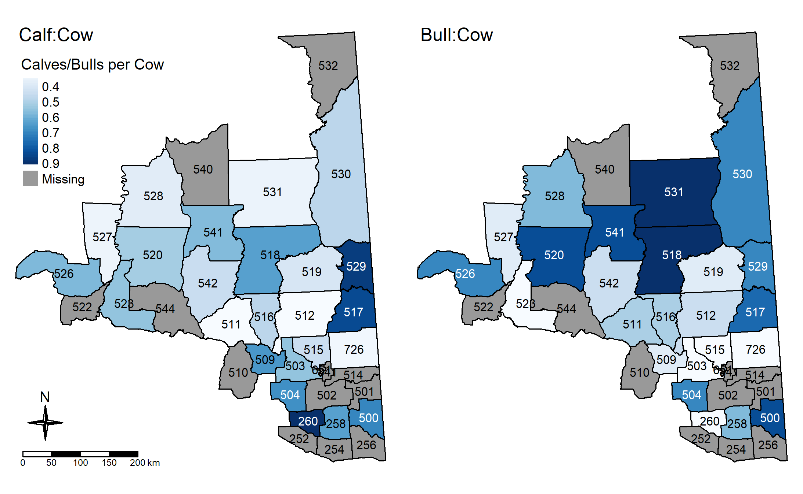

```{r include=TRUE, echo=TRUE, message=FALSE, warning=FALSE, eval=TRUE}

# Install packages
library(tidyverse)
library(sf)
library(leaflet)
library(leaflet.extras)
library(rgeos)
library(tmap) 
library(tmaptools)
library(plotly)
library(DT)
library(Hmisc)
library(knitr)
library(colourvalues)
library(leafgl)
library(rmapshaper)

# Set up working directory - Users to adjust as needed.
knitr::opts_knit$set(root.dir = "C:/Users/mabec/Documents/R/ABMI-Moose")

# Set global options for figures 
knitr::opts_chunk$set(out.width='80%', fig.align = "center")

```

# Executive Summary

We reviewed technical reports and peer-reviewed articles to assess the state of
knowledge of moose in Alberta's Oil Sands Region (OSR). Our intention was to
elucidate what is known concerning moose in the region, and in particular, what
the effect of oil and gas extraction has been on the moose population. In our 
review we extracted relevant estimates of moose population state variables, such 
as density and demographics, and in some cases made calculations or inferences 
based on these estimates (e.g. calculation of lambda). In addition to these 
estimates, we describe the findings of moose monitoring efforts in the region, 
in particular how moose respond to various natural and anthropogenic features. 
We use remote camera data from the Alberta Biodiversity Monitoring Institute's 
(ABMI) program to corroborate this information and provide additional context.  

Average moose population density among the Wildlife Management Units (WMUs) 
sampled in the OSR, as determined by aerial surveys conducted by the Government 
of Alberta between 2014-2018, is 0.17 individuals per km$^2$. Between 1993-2013,
moose density averaged 0.18 individuals per km$^2$. To fully assess whether 
there are any trends in time or space, further work would need to be done to 
calibrate density estimates from different sources or methods, and more sampling
will need to be conducted over the coming years. 
 
According to several studies, moose were sensitive to human disturbance, 
generally exhibiting low use and avoidance of human features across multiple 
scales of measurement (e.g. Boutin et al. 2015). Other research has found that
moose relative abundance decreases in relation to certain anthropogenic features
such as cutlines, well sites, trails, and pipelines (Fisher & Burton, 2018). 

+ This assessment will attempt to synthesize the findings from this literature
and report on areas of both agreement and contradictory findings. 

***

# Study Area

In this report, the study area is defined as that of the OSR of Alberta and all 
the WMUs that intersect it geographically (Figure 1).   

```{r include=TRUE, echo=TRUE, message=FALSE, warning=FALSE, eval=TRUE, out.width="60%", fig.cap="Figure 1. Study Area - Oil Sands Region boundary outlined in red."}

# Import spatial data from shapefiles located in SpatialData folder

# Oil Sands Region (OSR)
ab_osr <- st_read("./SpatialData/AB_OSR.shp", 
                  stringsAsFactors = FALSE, quiet = TRUE)
# WMUs intersected with the OSR
ab_wmu <- st_read("./SpatialData/AB_WMU-OSR-Intersect.shp", 
                  stringsAsFactors = FALSE, quiet = TRUE)
# Provincial polygon
ab_prov <- st_read("./SpatialData/AB_Prov.shp", 
                  stringsAsFactors = FALSE, quiet = TRUE)
# ABMI 1km pixels
pixel_1km <- st_read("./SpatialData/ABMI_Grid_1KM_OSM_v3.shp",
                     stringsAsFactors = FALSE, quiet = TRUE)

# Clean up and projection
ab_wmu <- ab_wmu %>%
  separate(WMUNIT_COD, into = c("zeroes", "WMU"), sep = 2, remove = FALSE) %>%
  select(-c(zeroes, Shape_STAr, Shape_STLe)) %>%
  # st_transform("+init=epsg:4326") %>%
  st_cast("POLYGON")
  
# ab_prov <- st_transform(ab_prov, "+init=epsg:4326")
# ab_osr <- st_transform(ab_osr, "+init=epsg:4326")

# Create static map (tmap)

tm_map_aoi <- ab_prov %>%
  tm_shape() +
  tm_borders(col = "black") +
  tm_shape(ab_wmu) +
  tm_fill(col = "grey90") +
  tm_borders(col = "black", lwd = 1) +
  tm_shape(ab_osr) +
  tm_borders(col = "brown", lwd = 5) +
  tm_compass(type = "4star", size = 2, position = c("left", "bottom")) +
  tm_scale_bar(position = c("left", "bottom")) +
  tm_layout(title = "", title.size = 1,
            legend.title.size = 1, frame = FALSE)



getwd()

```

***

# Data Sources

Summarize data sources included in this review.

+ Government of Alberta aerial surveys (1993-2019)
+ Peer-reviewed and grey literature 
+ Camera monitoring programs (e.g., Boreal Deer Project, ABMI)
+ Hunter harvest surveys

```{r include=TRUE, echo=TRUE, message=FALSE, warning=FALSE, eval=TRUE}

# Import raw moose data

# ABMI densities
df_abmi <- read_csv("./Data/Raw/ABMIMetrics.csv")
# Data from Government reports
df_all <- read_csv("./Data/Raw/Metrics.csv")
# Density data from more recent Government reports
df_gov_recent <- read_csv("./Data/Raw/OSM_Ungulate_Survey_Data_2013-2018_Density.csv")
# ABMI relative abundance predictions
abmi_pred <- read_csv("./Data/Raw/Moose_km2-summary.csv")

# Hunter harvest surveys?

```

***

# Results

## Population Parameters

Commonly used methods for estimating population parameters of moose in the 
province include aerial random block surveys, transect surveys, and distance 
sampling. The latter approach, which was adopted by the Government of Alberta 
for ungulate sampling in 2014, includes an estimate of detectability, which 
helps to correct for sightability bias inherent to the methods such as 
stratified random block (Peters et al. 2014). This technique accounts for 
variation in detectability by assuming that animals close to the observer are
more easily detected than when the animal is farther away (Buckland et al. 
1993). A recent review found that distance sampling, with the sightability
correction, likely provides more accurate estimates of parameters such as 
density and with greater efficiency, i.e. less flight hours (Peters et al 2014).
In this review we report results from both eras (1993-2013 using random block,
and 2014-present using distance sampling) but urge caution in direct comparison
between estimates using different methods. Without a detection adjustment, 
random block surveys are more likely to have underestimated moose populations.

### Density

#### Estimates from Aerial Surveys

Density of moose in the OSR was estimated using the most recent government 
reports for each WMU in the region 

We included density estimates from 19 government reports. The average density of
moose within WMUs of the OSR between 2014 and 2018 (the interval over which the
Government of Alberta began using the distance sampling method for aerial 
surveys) is 0.17 individuals per km$^2$. From 1993 to 2013, when the random 
block/Gasaway method was used, moose density averaged 0.18 individuals per 
km$^2$.

+ Note that data from 2019 aerial surveys will be available in early May - a 
total of 5 WMUs were flown this year. 

```{r include=TRUE, echo=TRUE, message=FALSE, warning=FALSE, eval=TRUE}

df_dens1 <- df_all %>%
  filter(Response == "Density",
         Species == "Moose",
         !is.na(WMU),
         !WMU == "506;510" & !WMU == "530 North" & !WMU == "530 South") %>%
  mutate(WMU = as.numeric(str_replace_all(WMU, "530 Full", "530"))) %>%
  select(WMU, StartYear, MetricNum, CIL, CIU) %>%
  rename(Survey_Year = StartYear,
         Density = MetricNum) %>%
  full_join(df_gov_recent, by = c("WMU", "Survey_Year")) %>%
  # WMUs 258, 511, and 519 have different density estimates. 
  mutate(Density = if_else(is.na(Density.y), Density.x, Density.y)) %>%
  select(-c(Density.x, Density.y)) %>%
  distinct() %>%
  mutate(WMU = as.character(WMU))

df_dens2 <- df_dens1 %>%
  group_by(Survey_Year) %>%
  summarise(mean_dens = mean(Density),
            count = n(),
            se = sd(Density)/sqrt(count))

```

Figure 2 below displays estimated moose density over time, split by WMU. The 
use can hover over each point to view the underlying information regarding 
survey year, estimated moose density, and WMU, as well as use the legend on the 
right of the plot to remove or add-in data from a particular WMU. By
double-clicking on a single WMU in the legend the user can isolate data from 
that unit. One outlier datapoint, a density estimate of 1.2 in WMU 515 in 2004, 
was removed from the plot for the sake of graphical clarity. 

```{r include=TRUE, echo=TRUE, message=FALSE, warning=FALSE, eval=TRUE, fig.cap = "Figure 2. Moose Density over Time, by WMU."}

dens1 <- df_dens1 %>%
  filter(Density < 1) %>%
  ggplot(aes(x = Survey_Year, y = Density, colour = WMU)) +
  geom_line() +
  geom_point(size = 2.5) +
  scale_x_continuous(breaks = c(1995, 2000, 2005, 2010, 2015)) +
  # labs(y = expression(Density~(per~km^2)), x = "") +
  labs(y = "Moose Density per square km", x = "") +
  theme_classic() +
  theme(axis.text.x = element_text(size = 12, angle = 45, hjust = 1),
        axis.text.y = element_text(size = 10))

# dens1

dens1_p <- ggplotly(dens1, width = 850)

dens1_p

```

Figure 3 displays the mean annual moose density across surveyed WMUs over time. 
The error bars are one standard error. The same outlier was removed from this
plot. 

```{r include=TRUE, echo=TRUE, message=FALSE, warning=FALSE, eval=TRUE, out.width="90%", fig.cap="Figure 3. Mean annual moose density in WMUs of the Oil Sands Region."}

dens2 <- df_dens2 %>%
  filter(mean_dens < 1.2) %>%
  ggplot(aes(x = Survey_Year, y = mean_dens)) +
  geom_point(aes(size = count)) +
  geom_errorbar(aes(ymin = mean_dens - se, ymax = mean_dens + se, 
                    width = 0.1)) +
  scale_x_continuous(breaks = c(1995, 2000, 2005, 2010, 2015)) +
  labs(y = expression(Density~(per~km^2)), x = "",
       size = "Number of WMUs Surveyed") +
  theme_classic() +
  theme(axis.text.x = element_text(size = 12, angle = 45, hjust = 1),
        axis.text.y = element_text(size = 10),
        legend.position = "bottom")
        # panel.border = element_blank(),
        # panel.grid.minor = element_blank()) 
  
dens2

# dens2_p <- ggplotly(dens2)

# dens2_p

# Do we want to include a table here simply showing the number of times each
# WMU has been surveyed?

tab1 <- df_dens1 %>%
  group_by(WMU) %>%
  summarise(count = n()) %>%
  arrange(desc(count))

```

The map below displays the moose density associated with each WMU in the study 
region, calculated from the most recent aerial survey undertaken. 

```{r include=TRUE, echo=TRUE, message=FALSE, warning=FALSE, eval=TRUE, fig.cap="Figure 4. Moose density in the OSR by WMU, using most recently available aerial survey."}

df_dens_curr <- df_dens1 %>%
  group_by(WMU) %>%
  slice(which.max(Survey_Year)) %>%
  mutate(Method = ifelse(Survey_Year >= 2014, 
                         "Distance Sampling",
                         "Random Block/Gasaway")) %>%
  ungroup()

ab_wmu_dens <- ab_wmu %>%
  left_join(df_dens_curr, by = "WMU") %>%
  select(WMUNIT_NAM, WMU, Survey_Year:Method)

# Static map

legend_title_dens <- expression("Density (animals per km"^2*")")

tm_map_dens <- ab_wmu_dens %>%
  tm_shape() +
  tm_fill(col = "Density",
          style = "cont",
          colorNA = "grey60",
          textNA = "Missing",
          title = legend_title_dens) +
  tm_borders(col = "black") +
  tm_text("WMU", size = 0.65) +
  tm_compass(type = "4star", size = 2, 
             position = c("left", "bottom")) +
  tm_scale_bar(position = c("left", "bottom"))

# tm_map_dens
# tmap_save(tm_map_dens, filename = "./tmap_png/dens.png", height = 6)

include_graphics("./png_files/dens.png")

```

The same map is displayed interactively below. The user can can click on each
individual WMU to retrieve the underlying data, as well as view detailed imagery
of the study area.

```{r include=TRUE, echo=TRUE, message=FALSE, warning=FALSE, eval=TRUE, out.width='100%', fig.height=10}

# Interactive leaflet map

# Set projections
ab_prov_proj <- st_transform(ab_prov, "+init=epsg:4326")
ab_osr_proj <- st_transform(ab_osr, "+init=epsg:4326")
ab_wmu_dens_proj <- st_transform(ab_wmu_dens, "+init=epsg:4326")

# Define colours
pal_1 <- colorNumeric(palette = "YlOrBr", domain = ab_wmu_dens$Density)

# Create df of WMU centroids for labels
df_centers <- ab_wmu_dens_proj %>%
  st_centroid() %>%
  as_Spatial()

# Create leaflet map
map_1 <-
ab_prov_proj %>%
  leaflet() %>%
  addTiles() %>%
  addProviderTiles("Stamen.TerrainBackground") %>%
  addProviderTiles("Esri.WorldImagery", group = "Imagery") %>%
  addFullscreenControl() %>%
  addResetMapButton() %>%
  addScaleBar(position = "bottomright", 
              options = scaleBarOptions(imperial = FALSE)) %>%
  setView(lng = -113.89, lat = 56.53, zoom = 6) %>%
  addMapPane(name = "OSR Boundary", zIndex = 420) %>%
  addMapPane(name = "Other", zIndex = 410) %>%
  
  # Polygon layers
  addPolygons(color = "#070707", weight = 1, smoothFactor =  0.2, 
              opacity = 2.0) %>%
  
  addPolylines(data = ab_osr_proj, color = "#070707", weight = 3,
              smoothFactor = 0.2, opacity = 3.0, fill = FALSE,
              group = "OSR Boundary",
              options = leafletOptions(pane = "OSR Boundary")) %>%
  
  addPolygons(data = ab_wmu_dens_proj, 
              color = "#070707", weight = 0.8,
              smoothFactor = 0.5, opacity = 1.0, fillOpacity = 0.75, 
              fillColor = ~ pal_1(Density), 
              popup = paste("WMU Name:", 
                            "<b>", ab_wmu_dens_proj$WMUNIT_NAM, "</b>", "<br>",
                            "WMU Code:", 
                            "<b>", ab_wmu_dens_proj$WMU, "</b>", "<br>",
                            "Moose Density:", 
                            "<b>", ab_wmu_dens_proj$Density, "</b>", "per km2", 
                            "<br>", 
                            "<br>",
                            "<i>", "Last surveyed in", 
                            ab_wmu_dens_proj$Survey_Year, "<i>"),
              group = "Moose Density - Aerial Surveys",
              options = leafletOptions(pane = "Other")) %>%
  
  # Labels
  addLabelOnlyMarkers(data = df_centers, label = ~WMUNIT_NAM,
                      group = "WMU Name Labels",
                      labelOptions = labelOptions(
                        noHide = TRUE,
                        textOnly = FALSE,
                        textsize = "10px",
                        opacity = 1,
                        offset = c(0,0)
                      )) %>%
  
  # Legend layer
  addLegend(data = ab_wmu_dens_proj, position = "bottomleft", pal = pal_1, 
            bins = c(0.1, 0.2, 0.3, 0.4, 0.5),
            values = ~Density, na.label = "No Data", 
            title = "Moose Density per km2",
            opacity = 1.0, group = "Moose Density - Aerial Surveys") %>%
  
  # Layers control
  addLayersControl(overlayGroups = c("Imagery",
                                     "Moose Density - Aerial Surveys",
                                     "WMU Name Labels",
                                     "OSR Boundary"),
                   options = layersControlOptions(collapsed = FALSE)) %>%
  
  hideGroup(c("Imagery", "WMU Name Labels"))

map_1

```

#### Estimates from Remote Camera Traps

The use of remote cameras (RCs) to monitor animal populations has grown 
substantially in recent years as technological progress has been made (Steenweg
et al. 2016). 

+ To be included: more background regarding the proliferation in the use of 
remote cameras in this context. 

##### ABMI Remote Cameras 

The ABMI uses remotely deployed cameras to assess the occurrence and 
density of mammals across Alberta. The RCs are deployed at sampling sites that 
are distributed along a 20 km systematic grid across the province. Four cameras
are deployed per site, two with lure and two without lure. In the OSR, 20% of 
sites are visited each year. RCs are relatively easy and cost-effective to 
deploy and allow for spatially explicit analysis of animal densities and 
occupancy. RCs also have the ability to provide more detailed information such 
as sex- and age-ratios, body condition, and behaviour as well as community level
metrics such as species richness and phenology (although the ABMI does not 
currently collect this information from RCs).

The ABMI estimates the density of mammals such as moose from RC data using the 
cumulative residency time (CRT) that the species is captured on camera. This 
method estimates density by assuming that animals use (and move across) the 
sampled area randomly such that the total residency time in any given location 
is a function of the number of animals in a fixed area. In addition, RCs can 
provide increased spatial resolution in the estimation of density when compared
to Government of Alberta aerial surveys, including support for more detailed
habitat modeling and predicted relative abundance across a heterogeneous
landscape. However, the widespread use of RCs in Alberta for ecological purposes
is still in a nascent phase, and questions remain about the precision, accuracy,
and required sampling effort of CRT analysis. 

Here we compare the ABMI's CRT-derived moose density estimates to those 
estimated by the Government of Alberta using distance sampling (i.e., aerial 
surveys conducted since 2014). We used the WMU as the sample unit, allowing us 
to compare the density estimate directly over the years 2014-2018. The ABMI 
estimates were calculated using all RC data from the years 2015-2017, whereas 
aerial survey density estimates were calculated from a singe year sample within 
the the five year time period. There were fourteen WMUs in the OSR that we were 
able to obtain moose density estimates from both sources. Table 1 below displays
the results, and the corresponding confidence intervals in estimates. 

```{r include=TRUE, echo=TRUE, message=FALSE, warning=FALSE, eval=TRUE}

df_abmi1 <- df_abmi %>%
  mutate(CI_abmi = paste(CIL, CIU, sep = ", ")) %>%
  rename(Density_abmi = Density) %>%
  # mutate(Survey_Year = NA) %>%
  na_if("NA, NA") %>%
  select(-c(CIL, CIU, Source))

df_dens_tab <- df_dens_curr %>%
  filter(Method == "Distance Sampling") %>%
  mutate(WMU = as.numeric(WMU),
         CIL = round(CIL, digits = 2),
         CIU = round(CIU, digits = 2),
         CI_gov = paste(CIL, CIU, sep = ", "),
         Density = round(Density, digits = 2)) %>%
         # SampleSize = NA) %>%
  na_if("NA, NA") %>%
  rename(Density_gov = Density,
         Source = Method) %>%
  select(WMU, Survey_Year, Density_gov, CI_gov) %>%
  full_join(df_abmi1, by = "WMU") %>%
  arrange(desc(SampleSize)) %>%
  mutate(WMU = as.character(WMU))

datatable(data = df_dens_tab, filter = "top", rownames = FALSE,
          caption = "Table 1. WMU-level Density Estimates Using Data from Aerial
          Surveys and ABMI Remote Cameras",
          class = 'cell-border-stripe',
          colnames = c("WMU", "Aerial Survey Year", 
                       "Density (Aerial)", "90% CI - Aerial",
                       "ABMI Camera Deployments", "Density (ABMI)", 
                       "90% CI - ABMI"),
          options = list(pageLength = 10, scrollX = TRUE))

```

Figure 6 displays the relationship between density estimates from the two 
different sources. A positive relationship was found, albeit a weak one. 

```{r include=TRUE, echo=TRUE, message=FALSE, warning=FALSE, eval=TRUE, fig.cap="Figure 6. Comparison of density estimates between aerial surveys and ABMI's remote cameras."}
  
# Prepare density data for comparison between sources
df_dens_comp <- df_dens_curr %>%
  filter(Method == "Distance Sampling") %>%
  mutate(WMU = as.numeric(WMU)) %>%
  rename(Density_gov = Density) %>%
  select(WMU, Density_gov) %>%
  full_join(df_abmi, by = "WMU") %>%
  filter(!is.na(Density_gov) & !is.na(Density)) %>%
  rename(Density_abmi = Density) %>%
  select(WMU, Density_gov, Density_abmi)
  
# Create scatterplot of density estimates
dens3 <- df_dens_comp %>%
  # Filter out outlier
  filter(Density_abmi < 4) %>%
  ggplot(aes(x = Density_gov, y = Density_abmi)) +
  geom_point() +
  geom_smooth(method = "lm", se = TRUE) +
  theme_classic() +
  labs(x = "Density Estimated via Aerial Surveys",
       y = "Density Estimated via ABMI RCs")

dens3

```

The ABMI CRT density estimates are generally higher than those produced by 
aerial survey distance sampling, but the two are weakly correlated. In addition, 
the ABMI estimates of moose density exhibit higher uncertainty, as shown by 
wider 90% confidence intervals. This uncertainty is related to the number of 
cameras placed in each WMU (Deployments in the above table), such that confidence 
increases when more cameras are available in a sampling unit. Most of the WMUs
in the OSR have less than 100 ABMI deployments, and therefore would be expected to 
have moose density confidence limits that are as wide as the mean (i.e., +/- 50%
of the mean if they were symmetrical) after one complete monitoring rotation 
(Huggard, 2019). This means that only large changes in moose population would be
detected with statistical confidence at the WMU-scale.

However, when mean density is estimated for the entire OSR using all ABMI RC 
deployments across the region, confidence intervals are narrowed. Estimated 
moose densities were 0.68, 0.54, and 0.41 animals per km$^2$ in 2015, 2016, and
2017, respectively[^1] (Table 2). 

[^1]: Rather than reflecting a true trend in population, this decline is likely 
due to cameras being put out in the field increasingly early each year. This 
means more sampling in the winter, which generally leads to less detections and 
lower density estimates (Huggard, 2019). The intent is to develop a seasonal 
correction procedure once the 2018 ABMI RC data is processed. 

```{r}

osr_dens <- data.frame(
  "Year" = c(2015, 2016, 2017),
  "Deployments" = c(174, 268, 225),
  "Density" = c(0.68, 0.54, 0.41),
  "CI" = c("0.51,0.9", "0.43,0.66", "0.32,0.5")
)

osr_dens <- osr_dens %>%
  mutate(CI = as.character(CI)) %>%
  rename('90% CI' = CI)

datatable(data = osr_dens, rownames = FALSE,
          caption = "Table 2. Density Estimates for Entire OSR By Year, Using 
          ABMI Remote Camera Data",
          class = 'cell-border-stripe')

```

According to Huggard (2019), moose density estimates from ABMI's RCs are likely 
to be biased upwards. The first reason for this is a practical element of using RCs: 
cameras are usually placed in small openings so that they are not obscured by 
vegetation. However, moose tend to use these areas preferentially for foraging 
(at least in the summer), leading to overestimates of density. The second reason
is that moose are also attracted to the cameras (lure or no lure). In order to 
get accurate absolute density estimates from RCs, a calibration procedure using
other methods (such as aerial surveys) will likely be required. However, RC data
can still be useful as relative abundance estimates, and be used for habitat 
modeling (see Section 4.2 on Distribution) and for long-term trend analysis.

##### Other Remote Camera Monitoring Programs in Alberta

+ This section will include work from a variety of research programs and 
published literature in the area (e.g. findings from the Boreal Deer Project, 
Fisher & Burton, 2018).

### Lambda

Only one document (Rolley and Keith, 1980) estimated the geometric rate of 
increase of moose populations in northeastern Alberta directly. Whereas the
study area was not within the OSR, we present the values here as a historical
reference. In Rochester, Alberta, which was the study area, the geometric rate 
of increase in moose was 1.24 and 1.03 in 1965 and 1979, respectively. 

We calculated lambda for 9 WMUs from 13 Government of Alberta reports between 
1993 and 2018 (Table 2). Across all WMUs and years, mean lambda was 1.03. As 
should be expected given the stability of moose density in Northeastern Alberta,
lambda is near one for all WMUs with reported metrics of density across multiple
years (Table) but varies by WMU, with growth rates generally decreasing with
latitude (Figure 7). 

```{r include=TRUE, echo=TRUE, message=FALSE, warning=FALSE, eval=TRUE}

# Calculating lambda

# Included all aerial surveys, with both methods. This might not be correct.

df_lamb1 <- df_dens1 %>%
  group_by(WMU) %>%
  add_tally() %>%
  # Filter out WMUs that have not been surveyed at least twice
  filter(n > 1) %>%
  arrange(WMU, Survey_Year) %>%
  # Calculate lambda
  mutate(Ndelta = Density - lag(Density),
         Tdelta = Survey_Year - lag(Survey_Year),
         Adelta = Ndelta / Tdelta,
         Delta = lag(Density) + Adelta,
         Lambda = Delta / lag(Density)) 

df_nsurveys <- df_dens1 %>%
  group_by(WMU) %>%
  add_tally() %>%
  select(WMU, n) %>%
  distinct()

df_lamb2 <- df_lamb1 %>%
  group_by(WMU) %>%
  # Calculate average lambda for WMUs with more than one value
  summarise(Lambda_u = mean(Lambda, na.rm = TRUE)) %>%
  left_join(df_nsurveys, by = "WMU") %>%
  mutate(Lambda_u = round(Lambda_u, digits = 2))

datatable(data = df_lamb2,
          class = 'cell-border stripe',
          colnames = c("WMU", "Lambda",
                       "Number of Surveys"),
          rownames = FALSE,
          width = 500,
          options = list(
            columnDefs = list(list(className = 'dt-left', targets = 1)),
            pageLength = 14,
            dom = 't')) 

```

``` {r include=TRUE, echo=TRUE, message=FALSE, warning=FALSE, eval=TRUE, fig.cap="Figure 7. Moose lambda in WMUs across the OSR. Includes WMUs which have been surveyed at least twice between 1993-2018."}

# Join lambda information to WMU polygons
ab_wmu_lamb <- ab_wmu %>%
  left_join(df_lamb2, by = "WMU")

# Create static map of lambda

legend_title_lamb <- "Lambda"

tm_map_lamb <- ab_wmu_lamb %>%
  tm_shape() +
  tm_fill(col = "Lambda_u", 
          palette = "-RdBu", 
          midpoint = 1,
          style = "cont",
          colorNA = "grey60",
          textNA = "Missing",
          title = legend_title_lamb) +
  tm_borders(col = "black") +
  tm_text("WMU", size = 0.65) +
  tm_compass(type = "4star", size = 2, 
             position = c("left", "bottom")) +
  tm_scale_bar(position = c("left", "bottom"))

# tm_map_lamb
# tmap_save(tm_map_lamb, filename = "./png_files/lamb.png", height = 6)

include_graphics("./png_files/lamb.png")

```

### Demographics

Of the documents we reviewed, 22 reported on either calf:cow or bull:cow ratios
(or both). Including multiple values from government reports provided a total 
of 116 data points of either sex or calf ratios. 

Across all years and WMUs for which ratios were reported,

+ The mean calf:cow ratio was **0.52**;
+ The mean bull:cow ratio was **0.51**.

As shown in Figures 8 and 9, no clear trend in sex or calf ratios was observed 
either temporally or spatially.

```{r include=TRUE, echo=TRUE, message=FALSE, warning=FALSE, eval=TRUE, fig.cap="Figure 8. Changes in moose sex and calf ratios over time in the OSR."}

# Prepare df of demographic data
df_demo <- df_all %>%
  filter(Response == "CalfCow" | Response == "MaleFemale",
         Species == "Moose",
         !is.na(WMU)) %>%
  separate(MetricText, into = c("numerator", "denominator"), sep = ":") %>%
  mutate(numerator = as.numeric(numerator), 
         denominator = as.numeric(denominator),                                     
         ratio = numerator / denominator) %>%
  mutate(ratio = if_else(is.na(ratio), MetricNum, ratio)) %>%
  select(WMU, StartYear, Response, ratio) %>%
  filter(!WMU == "518;519;529;530;531" & !WMU == "506;510" &
         !WMU == "518;530;531" & !WMU == "530 North" & !WMU == "530 South") %>%
  mutate(WMU = as.numeric(if_else(WMU =="530 Full", "530", WMU)),
         Response = str_replace_all(Response, "MaleFemale", "Bull:Cow"),
         Response = str_replace_all(Response, "CalfCow", "Calf:Cow"))

df_demo1 <- df_demo %>%
  # Important to group by both start year and reponse in order to retain two
  # observations for each year of data (CalfCow & MaleFemale)
  group_by(StartYear, Response) %>%
  # Calculate average ratios for each year, across WMU
  summarise(ratio_u = mean(ratio))

# Create scatterplot of demographics (ratios) over time, averaged across WMU

demo1 <- df_demo1 %>%
  mutate(Response = factor(Response, levels = c("Calf:Cow", "Bull:Cow"))) %>%
  ggplot(aes(x = StartYear, y = ratio_u)) +
  geom_point() +
  # Facet wrap to visualize CowCalf and MaleFemale separately. 
  facet_wrap(~ Response) +
  # Add trendline. Maybe "lm" method is better here?
  geom_smooth(method = "loess", se = FALSE) +
  scale_x_continuous(breaks = c(1995, 2000, 2005, 2010, 2015)) +
  labs(y = "Ratio (per Cow)",
       x = "") +
  theme_bw() +
  theme(axis.text.x = element_text(size = 10, angle = 45, hjust = 1),
        axis.text.y = element_text(size = 10),
        panel.grid.minor = element_blank())

demo1

```

```{r include=TRUE, echo=TRUE, message=FALSE, warning=FALSE, eval=TRUE, out.width='100%', fig.cap="Figure 9. Spatial variation in moose sex and calf ratios across the OSR. The most recent datapoints of these demographic variables were used."}

# Create static map of demographics

# Prepare df of most recent datapoints for each WMU
df_demo2 <- df_demo %>%
  # Important to group by both WMU and reponse in order to retain two
  # observations for each WMU (CalfCow & MaleFemale)
  group_by(WMU, Response) %>%
  slice(which.max(StartYear))

# Prepare colors (Blues)
c1 <- c('#f7fbff','#deebf7','#c6dbef',
        '#9ecae1','#6baed6','#4292c6',
        '#2171b5','#08519c','#08306b')
c2 <- colorRampPalette(c1)

legend_title_demo1 <- "Calves/Bulls per Cow"

# Prepare spatial data
ab_wmu_demo <- ab_wmu %>%
  mutate(WMU = as.numeric(WMU)) %>%
  # Full join in order to retain both Response types
  full_join(df_demo2, by = "WMU") %>%
  select(WMUNIT_NAM, WMU, StartYear:ratio) %>%
  mutate(bin = as.numeric(cut2(ratio, g = 10)),
         colour = c2(10)[bin]) %>%
  mutate(colour = if_else(is.na(colour), "#999999", colour))

# Map 1 (CalfCow)  
tm_map_demo1 <- ab_wmu_demo %>%
  filter(Response == "Calf:Cow" | is.na(Response)) %>%
  tm_shape() +
  tm_fill(col = "ratio",
          palette = c1,
          style = "cont",
          colorNA = "grey60",
          textNA = "Missing",
          title = legend_title_demo1) +
  tm_borders(col = "black") +
  tm_text("WMU", size = 0.65) +
  tm_compass(type = "4star", size = 2, 
             position = c("left", "bottom")) +
  tm_scale_bar(position = c("left", "bottom")) +
  tm_layout(title = "Calf:Cow", title.size = 1,
            legend.title.size = 1, frame = FALSE)

# Map 2 (BullCow)
tm_map_demo2 <- ab_wmu_demo %>%
  filter(Response == "Bull:Cow" | is.na(Response)) %>%
  tm_shape() +
  tm_fill(col = "colour",
          style = "cont") +
  tm_borders(col = "black") +
  tm_text("WMU", size = 0.65) +
  tm_layout(title = "Bull:Cow", title.size = 1,
            legend.title.size = 1, frame = FALSE)

# Combine two maps
tm_map_demo_both <- tmap_arrange(tm_map_demo1, tm_map_demo2)

# tm_map_demo_both
# tmap_save(tm_map_demo_both, filename = "./tmap_png/demo.png")



```

### Survival

We extracted either adult or calf survival values from three reviewed documents
(9% of the total) for a combined 10 survival estimates. Calf survival was lower
than adult survival and was higher when estimated with GPS telemetry vs. radio
telemetry. 

***

## Distribution and Relative Abundance

The following section details research related to the distribution, occupancy, 
and relative abundance of moose in the OSR as a function of various 
anthropogenic and natural features. 

### Habitat Associations

Fisher and Burton (2018) studied the relative abundance of various mammal
species in the OSR of Alberta using camera traps, sampling from 62 sites between
October 2011 - October 2014. They concluded that human disturbance in the region
has created "winners and losers" among the mammal community, and that moose are
among those species whose relative abundance has been reduced. Anthropogenic 
landscape variables, such as cutlines, well sites, and pipelines, were found to
have a net negative response on moose occurence frequency; however, several 
anthropogenic categories, such as cutblocks and 3D seismic lines, had a positive
effect. Natural features such as lowland/upland spruce, lowland/upland 
mixedwood, and open wetlands were also found to have a positive effect on moose
abundance. Taken together, moose displayed a net negative response to landscape
level disturbance in the OSR.

The ABMI uses data collected from RCs to estimate species-specific habitat 
models, and then uses these models to predict the relative abundance of each 
species across the landscape. Explanatory variables in these models include 
prevalance of nearby human footprint and native landcover, as well as spatial
and climate covariates. Models are estimated for two separate regions of the 
province, a north and a south region, and different combinations of covariates
are used for each. In this report, we consider only the north regional models.

Separate models are estimated for camera deployments during the 
summer and the winter, in order to account for differing detection rates as 
vegetation grows and obscures the camera field of view, as well as seasonal 
differences in species' habitat use patterns. Using RC data from 2015-2018,
these models were used to show how moose relative abundance differed among 
vegetation and human footprint in northern region (which is comprised of the
Boreal and Foothills natural regions) - see Figures 10 and 11 for the winter and 
summer models, respectively. Predicted moose abundance in each habitat type is 
shown with bars, and vertical lines indicate 90% confidence intervals. Only 
habitat and human footprint categories that are statistically separable are
displayed.

```{r include=TRUE, echo=TRUE, message=FALSE, warning=FALSE, eval=TRUE, out.width="100%",fig.cap=c("Figure 10. Moose Habitat Associations in Northern Alberta - Summer", "Figure 11. Moose Habitat Associations in Northern Alberta - Winter")}

include_graphics("./png_files/Veg+HF_figure_MooseSummer.png")

include_graphics("./png_files/Veg+HF_figure_MooseWinter.png")

```

In the summer, the models of habitat association suggest that moose show a 
preference for shrub and grassland areas, as well as marshes. In addition, moose
prefer older deciduous forest, but younger mixedwood areas. In the winter, an
opposite preference for mixedwood is found.

### Predictions of Relative Abundance

The ABMI uses these habitat association models, plus models describing how 
species vary spatially and with climate gradients, to predict species abundance
in 1 km$^2$ spatial units under both *current* and *reference* conditions. 
Current condition predictions are made based on the vegetation and human 
footprint currently present in each 1 km$^2$ unit, whereas reference condition
predictions are made after human footprint has been erased and the native 
vegetation 'backfilled' in the unit based on the surrounding area.

+ Further writing will describe the usefulness of these predictions for trend
analysis.

The reader can view an interactive map below of the ABMI's current relative 
abundance predictions for moose across the OSR, using RC data from 2015-2017. 
Pixels depicted in red are predicted to have the highest abundance for moose, 
whereas in areas of dark blue moose are expected to be less abundant or absent.

```{r include=TRUE, echo=FALSE, message=FALSE, warning=FALSE, eval=TRUE, out.width="100%", fig.height=10}

# Interactive leaflet map

pixel_1km_aoi <- pixel_1km %>%
  separate(WMUNIT_COD, into = c("zeroes", "WMU"), sep = 2, remove = FALSE) %>%
  select(-zeroes) %>%
  select(GRID_LABEL, WMUNIT_NAM, WMU) %>%
  rename(LinkID = GRID_LABEL) %>%
  # Join in Moose prediction data
  left_join(abmi_pred, by = "LinkID") %>%
  filter(!is.na(Curr)) %>%
  # Set projection
  st_transform("+init=epsg:4326") %>%
  st_cast("POLYGON") %>%
  ms_simplify(sys = TRUE) %>%
  # Subset
  mutate(q_curr = as.numeric(cut2(Curr, g = 100))) %>%
  select(q_curr)

# Define colors

c1 <- c("blue", "white", "red")
c2 <- colorRampPalette(c1)
colours <- c2(100)[pixel_1km_aoi$q_curr]

colours1 <- (convert_colors(colours)) / 255

pal_2 <- colorNumeric(c("blue", "white", "red"),
                      domain = pixel_1km_aoi$q_curr)

map_2 <- 
  ab_wmu %>%
  st_transform("+init=epsg:4326") %>%
  leaflet() %>%
  addTiles() %>%
  addProviderTiles("Stamen.TerrainBackground") %>%
  addProviderTiles("Esri.WorldImagery", group = "Imagery") %>%
  addFullscreenControl() %>%
  addResetMapButton() %>%
  addScaleBar(position = "bottomright", 
              options = scaleBarOptions(imperial = FALSE)) %>%
  setView(lng = -113.89, lat = 56.53, zoom = 6) %>%
  
  # Polygon layers
  addPolygons(color = "#070707", weight = 2,
              smoothFactor = 0.2, opacity = 2.0,
              popup = paste("WMU Name:", 
                            "<b>", ab_wmu$WMUNIT_NAM, "</b>", "<br>",
                            "WMU Code:", 
                            "<b>", ab_wmu$WMU, "</b>", "<br>")) %>%
  
  addGlPolygons(data = pixel_1km_aoi,
                color = colours1,
                group = "ABMI Relative Abundance Predictions",
                opacity = 0.75) %>%
  
  addLegend(data = pixel_1km_aoi, position = "bottomleft", pal = pal_2, 
            bins = 10, values = ~q_curr, 
            title = "Relative Abundance of Moose", 
            opacity = 0.9, group = "ABMI Relative Abundance Predictions") %>%
  
  # Layers control
  addLayersControl(overlayGroups = c("Imagery", 
                                     "ABMI Relative Abundance Predictions"),
                   options = layersControlOptions(collapsed = FALSE)) %>%
  
  hideGroup("Imagery")
  
map_2

```

### Other Literature

Two other reviewed documents estimated moose density as a function of 
environmental variables. The first (Schneider et al. 2000) examined broad scale 
changes to moose density across Northern Alberta using random stratified block 
aerial surveys. Moose median densities increased from 0.25 per km$^2$ in the 
green zone, which is characterized by forestry as the dominant land use, to 0.4 
per km$^2$ in the white zone, which is primarily agriculture and human 
settlement. Moose density was also found to be higher in the foothills and 
mixedwood regions. Schneider et al. (2000) also measured changes in moose 
density along gradients of human activity and found that density was higher 
closer to the white zone and with decreasing latitude. Ferguson and Keith (1982)
found that, within 500 m of either high or low use cross country ski trails in 
Elk Island National Park, moose density increased or decreased respectively, 
compared to farther than 500 m. 

### Behaviour

+ Review documents related to moose behaviour and effect of human activity
(mostly with studies using telemetry data). 

### Selection

+ Review literature on moose selection of various features relative to their
availability.

### Home Range Area

# Discussion

We reviewed government and non-government reports, and peer reviewed papers to 
assess the state of knowledge concerning the impact of human disturbance on
moose populations in Oil Sands Region (OSR) of Alberta. Moose are a well-studied
species in Canada broadly and in Alberta specifically. We were able to summarize
moose density across both time and space, calculate geometric rates of change 
(lambda), and report on calf:cow and bull:cow ratios in several WMUs within and
adjacent to the region. Further, we were able to assess moose behavioural 
responses to several types of human disturbance at multiple scales. In general,
we did not reveal any strong trends in the density of behaviour of moose as a 
function of time, space or human disturbance; however, certain studies have 
reported that moose abundance is negatively impacted by anthropogenic 
disturbance in the OSR region (Fisher and Burton, 2018).

+ Discussion section under ongoing development.

# Literature Cited

Boutin, S., H. Bohm, E. Neilson, A. Droghini, & C. de la Mare. (2015). Wildlife Habitat Effectiveness and Connectivity Research Program, Final Report.

Fisher, J. T., & Burton, A. C. (2018). Wildlife winners and losers in an oil sands landscape. Frontiers in Ecology and the Environment, 16(6), 323-328.

Neilson, E. W., & S. Boutin. (2017). Human disturbance alters the predation rate of moose in the Athabasca oil sands. Ecosphere 8:1–12.

Schneider, R. R., S. Wasel, & A. Press. (2000). The Effect of Human Settlement on the Density of Moose in Northern Alberta. Journal of Wildlife Management 64:513–520.

Steenweg, R., Hebblewhite, M., Kays, R., Ahumada, J., Fisher, J. T., Burton, C., ... & Brodie, J. (2017). Scaling‐up camera traps: Monitoring the planet's biodiversity with networks of remote sensors. Frontiers in Ecology and the Environment, 15(1), 26-34.

+ To add: Document from D. Huggard (2018)


